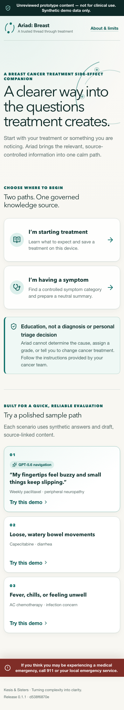
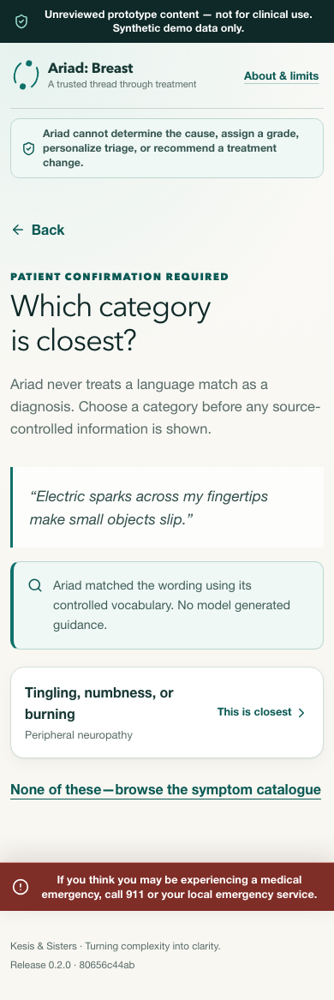
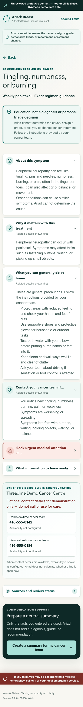
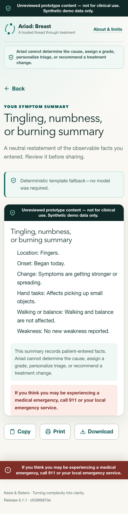
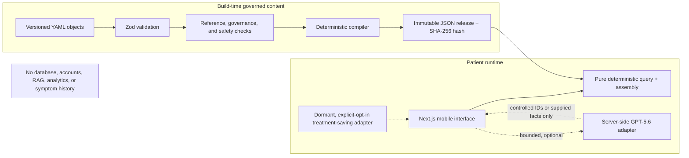

# Ariad: Breast

**A breast cancer treatment side-effect companion**  
**A trusted thread through treatment**

> **Unreviewed Build Week prototype — not for clinical use.** Every
> patient-facing clinical module is a draft. No clinician reviewer, review date,
> approval, or production release has been recorded.

Ariad helps adults receiving systemic therapy for breast cancer move from a
treatment or something they are noticing to treatment-aware education, fixed
warning information, and a neutral summary they can choose to share with their
cancer team.

The central design choice is a hard separation of responsibilities:

> **Current runtime mode — deterministic only.** By owner decision on
> 2026-07-19, the optional GPT-5.6 adapter is disabled while development focuses
> on governed deterministic behavior and clinic data. No patient input is sent
> to OpenAI in this mode.

> **If reauthorized in a later phase, GPT-5.6 may handle bounded
> natural-language symptom navigation and neutral symptom-summary generation.
> It never generates clinical guidance. Clinical guidance is assembled
> deterministically from an immutable, source-controlled release.**

That is the production architecture contract. In this Build Week artifact, the
immutable release is an explicitly unreviewed draft preview, is not approved
for clinical use, and cannot pass the ordinary production build gate.

Built by **Kesis & Sisters** for the OpenAI Build Week 2026 **Apps for Your
Life** track.

- Live demo: **TODO — add public URL after deployment**
- Demo video: **TODO — add public YouTube URL, no more than three minutes**
- Primary Codex `/feedback` Session ID: **TODO before submission**
- Build evidence: [BUILD_WEEK.md](./BUILD_WEEK.md)

## What the prototype demonstrates

- Two equal entry points: **I’m starting treatment** and **I’m having a
  symptom**.
- Deterministic search across 53 canonical drug records, eight regimens, ten
  treatment classes, and 28 patient-observable symptom concepts.
- Fifty-two drug records pin exact FDA label identities and safety-section
  locations. Twenty-five now have separately governed single-agent FDA evidence
  from breast-cancer populations; carboplatin adds one cross-indication FDA
  single-agent map, while cyclophosphamide, doxorubicin, and epirubicin add
  non-numerical FDA label-category maps. Pembrolizumab adds a cross-cancer FDA
  single-agent label-category map. Twenty-three breast-label entries remain
  source indexes.
- Explicit coverage states: full demo guidance, education only, catalogued, or
  unsupported.
- Three complete draft symptom pathways:
  - weekly paclitaxel + tingling, numbness, or burning;
  - capecitabine + diarrhea;
  - AC chemotherapy + fever, chills, or infection concern.
- A preparation guide for every one of the 53 drug choices and eight regimen
  choices. Weekly paclitaxel, capecitabine monotherapy, and AC have exact draft
  overlays; every other choice uses a clearly labelled general guide. The same
  governed modules are presented as three plain-language preparation questions.
- Thirty draft single-drug side-effect pages with qualitative frequency
  or FDA label-category groups, plain-language disclosures, FDA-linked actions,
  and a final escalation summary for each drug.
- Multi-drug regimen pages compose those existing single-drug presentations in
  separate component cards, preserve their monotherapy evidence boundaries, and
  retain a clear preparation notice for components without eligible evidence.
- Observable questions that may change section emphasis, but never calculate a
  grade, diagnosis, cause, or personal urgency.
- Deterministic controlled-vocabulary symptom matching and neutral fact
  summaries. A bounded GPT-5.6 adapter is implemented but currently disabled.
- A content-addressed preview release containing 492 exact object versions.
- Source panels, an exact-version structured synthetic clinic configuration,
  treatment-code demos, direct treatment links, and copy/print/download symptom
  summaries. Treatment saving is disabled in the competition build. The clinic's
  fever and supportive-care policy bindings remain explicitly unresolved.

## Product evidence

| Dual-entry home | Controlled symptom match |
|---|---|
|  |  |

| Source-controlled guidance | Neutral summary |
|---|---|
|  |  |

These 390 px captures are reproducible with `pnpm screenshots`. The capture
harness deliberately uses the controlled deterministic match and summary
fallback; screenshots are not presented as evidence of a successful live model
call.

## Try the three sample paths

No account or patient information is required.

| Scenario | Fastest path | What it shows |
|---|---|---|
| Weekly paclitaxel + neuropathy | Home → sample 01; use the prefilled wording | Controlled-vocabulary navigation (deterministic now), patient confirmation, six observable questions, fixed guidance, neutral summary |
| Capecitabine + diarrhea | Home → sample 02 | Seven observable questions, fixed home-management and warning sections, summary |
| AC + infection concern | Home → sample 03 | Conservative high-stakes boundary, non-actionable synthetic clinic contacts, unresolved local fever policy, no invented threshold |

The treatment-code demonstration accepts `THREAD-PAC-01`, `THREAD-CAPE-02`,
and `THREAD-AC-03`. These codes contain no personal information.

## Intended use and non-negotiable boundary

> Ariad: Breast is a patient-facing educational tool for adults receiving
> systemic therapy for breast cancer. It provides treatment-specific
> side-effect education, low-risk home-management measures, and
> clinician-approved escalation information based on a selected treatment and
> symptom. It does not diagnose a toxicity, determine its cause, assign a
> toxicity grade, calculate a personalized escalation level, recommend changing
> or stopping cancer treatment, prescribe therapy, or replace the treating
> cancer team.

That statement describes the intended governed product. The current artifact
does **not** contain clinician-approved content and is therefore labelled
`clinical_use: false` throughout. It may display fixed draft sections titled
“Contact your cancer team if…” and “Seek urgent medical attention if…”, but it
does not interpret answers to tell an individual what action to take.

Every symptom path states that Ariad cannot determine the cause and keeps this
universal statement visible:

> If you think this is a medical emergency, call 911 or your local emergency
> service now.

This statement is an application safety constant. Clinic configuration cannot
replace, suppress, or edit it.

See [intended use](./docs/intended-use.md), [product
scope](./docs/product-scope.md), and [clinical
safety](./docs/clinical-safety.md).

## Architecture



The repository is a pnpm workspace:

- `apps/web` — Next.js App Router interface and bounded server routes.
- `packages/contracts` — strict Zod schemas and shared public types.
- `packages/knowledge-core` — pure validation, search, compilation, guidance,
  and summary fallback logic.
- `content` — diff-friendly versioned objects, sources, release manifest, and
  generated review report.
- `apps/web/src/generated` — compiler output; never hand-edit it.

More detail: [architecture](./docs/architecture.md), [data
flow](./docs/data-flow.md), [knowledge model](./docs/knowledge-model.md), and
[ADRs](./docs/adr/README.md).

## Optional GPT-5.6 integration — currently disabled

The OpenAI API key remains server-side. The runtime model defaults to
`gpt-5.6`, but `ENABLE_GPT56=false` is the repository and local default. The
current development mode does not call OpenAI.

1. **Natural-language symptom navigator.** The client first tries deterministic
   synonym/fuzzy matching. If confidence is insufficient, the server asks
   GPT-5.6 to return at most three IDs from the active symptom catalogue. The
   patient must confirm a category before guidance appears.
2. **Neutral symptom-summary generator.** GPT-5.6 may restate only the supplied
   observable answers. The server checks field-level provenance and prohibited
   recommendation language. Invalid or unavailable output is replaced with a
   deterministic template.

The model has no tools, runtime web search, retrieval corpus, patient record, or
authority to author guidance. Disabling the model preserves controlled symptom
selection and deterministic summaries.

## Quick local setup

Prerequisites: Node.js 22 or newer (Node 24 is used in CI) and pnpm 11.9.0. No
OpenAI API key is required for deterministic-only development.

```bash
pnpm install --frozen-lockfile
cp .env.example .env.local
pnpm dev
```

Open `http://localhost:3000`. The development command compiles the explicitly
labelled unreviewed preview before starting Next.js.

Do not enable GPT-5.6 during the current deterministic and clinic-data phase.
If the owner later reauthorizes model testing, the dormant server adapter
requires these server-only values in `.env.local`:

```text
OPENAI_API_KEY=<your key>
OPENAI_MODEL=gpt-5.6
ENABLE_GPT56=true
```

The checked-in example and current local configuration set
`ENABLE_GPT56=false`. The API key may remain stored for later use; never commit
`.env.local`.

### Environment variables

| Variable | Purpose | Default/example |
|---|---|---|
| `OPENAI_API_KEY` | Server-only credential | blank |
| `OPENAI_MODEL` | Runtime language model | `gpt-5.6` |
| `ENABLE_GPT56` | Exact opt-in for optional model calls; keep disabled during the current phase | `false` |
| `AI_MAX_INPUT_CHARS` | Server request input limit, clamped to 50–500 characters | `500` |
| `AI_REQUEST_TIMEOUT_MS` | Provider timeout | `12000` |
| `CONTENT_RELEASE_ID` | Exact release manifest to compile | `build-week-preview-2026-07-18` |
| `ALLOW_DRAFT_CONTENT` | Exact preview acknowledgement; never a production convenience flag | `false` |
| `NEXT_PUBLIC_DEMO_MODE` | Preview-build marker; the mandatory UI notice comes from the compiled release | `true` for preview |
| `NEXT_PUBLIC_ENABLE_TREATMENT_SAVING` | Exact opt-in for device-local saved treatments; forced off in the competition build | `false` |

## Validation and builds

```bash
pnpm lint
pnpm typecheck
pnpm test
pnpm content:validate
pnpm safety:scan
pnpm content:report
pnpm build:preview
pnpm test:e2e
```

Install the Playwright Chromium runtime first if it is not already present:

```bash
pnpm exec playwright install chromium
```

`pnpm content:build` and `pnpm build` are intentionally fail-closed today: the
only available release is a draft preview. Use `pnpm content:build:preview` or
`pnpm build:preview` only for the conspicuously labelled Build Week artifact.
The ordinary production path must not silently ship drafts.

The active preview is release `build-week-preview-2026-07-18`, version `0.12.0`,
with content hash
`e6e48a385d21e8ec8692642439a6fc4d272828b0e809f3e97e76d69a08f59e56`.

## Content and source governance

The current release pins 492 object versions: 391 governed draft objects and
101 source records. Its 139 patient-facing modules have zero recorded clinical
approvals; all 30 drug presentations are also unreviewed drafts. The repository
review queue contains 451 governed object versions: the 391 release objects, 25
superseded symptom versions, four superseded weekly-paclitaxel preparation
modules, the retained v1 clinic configuration, and 30 private draft
toxicity-evidence records.
The release pins the v2 clinic configuration and patient-safe presentations,
but deliberately excludes the numerical evidence payloads. That structured
synthetic configuration contains identity
and non-actionable contact data, not patient-facing clinical instructions. Its
fever and supportive-care policy bindings are unresolved, and two modules retain
explicit fever placeholders. The preview includes 25 general symptom fallbacks,
but catalogue presence never implies an exact treatment-specific pathway. No
schema, validation, or preview compilation result records or implies a clinical
approval.

The drug catalogue remains an identity-and-provenance foundation. A separate,
source-controlled toxicity evidence store now contains 30 draft FDA evidence
records: 25 breast-cancer single-agent populations, one cross-indication
carboplatin single-agent population, and three FDA label-category records for
cyclophosphamide, doxorubicin, and epirubicin without usable denominators.
Pembrolizumab adds a cross-cancer FDA single-agent label-category record. Each
stores its exact evidence boundary, source
event names, frequency status, and available values outside the browser release.
A content hash binds each evidence record to its patient-safe
presentation. The three complete draft treatment-toxicity relationships remain
regimen-level; the drug pages are education-only and do not create personalized
symptom pathways or treatment recommendations. The full eligibility and gap
ledger is [documented here](./docs/fda-single-drug-toxicity-coverage.md).

Sources are recorded with organization, jurisdiction, canonical HTTPS link,
date/version when available, access date, verification state, and notes. Exact
current FDA labels establish the initial breast-cancer drug identity and safety
section index. All current single-drug toxicity drafts use FDA material only.
Existing symptom pathways retain their governed Ontario Health/Cancer Care
Ontario, Health Canada, BC Cancer, and eviQ sources. Ariad stores short metadata
and clinician-reviewable paraphrases, not copied source documents.

Before any clinical release, the owner must review every module, all 27
evidence-to-presentation mappings, and each claim-to-source mapping; resolve the
fever and diarrhea discrepancies; confirm the AC regimen variant; create real
approval evidence; and compile a separate exact-version published release. See [content
governance](./docs/content-governance.md) and the generated [review
report](./content/review-report.md).

## Privacy and security posture

- No patient or clinician accounts.
- No names, birth dates, identifiers, contact capture, medical uploads, or
  electronic medical-record integration.
- No database, server-side symptom history, longitudinal diary, or analytics.
- The competition build does not save treatment choices. It removes any legacy
  Ariad preference record when the application starts.
- Symptom free text and answers remain ephemeral in the interface. When
  GPT-5.6 is enabled, the minimum required text/facts are sent to the bounded
  server endpoint and model provider; users are told not to enter identifying
  information.
- Summaries are created on demand and may be copied, printed, or downloaded by
  the user; Ariad does not create a server record.

This is a competition prototype, not a production privacy or clinical-safety
assessment. See the [threat model](./docs/threat-model.md).

## Codex collaboration

The primary Codex build thread established the repository, safety contract,
monorepo, governed knowledge schemas, compiler, content release, golden paths,
patient interface, and bounded GPT-5.6 integration. Human decisions locked the
intended use and clinical boundary; Codex made reversible engineering choices
and recorded consequential ones as [ADRs](./docs/adr/README.md).

The dated [Build Week evidence log](./BUILD_WEEK.md) distinguishes human
clinical/product decisions, Codex contributions, commands run, limitations,
and commits. Run `/feedback` in the primary Codex task before submission and
record the resulting Session ID there and above.

## Deployment

The app is prepared for a single Vercel deployment or the included standalone
Docker image. No public deployment is claimed in this README.

- **Vercel preview:** use `pnpm build:preview` and configure server-only
  environment variables in the project settings. Keep the prototype notice and
  `clinical_use: false` release intact.
- **Docker preview:** pass the exact acknowledgement only to the controlled
  preview build:

  ```bash
  docker build \
    --build-arg ALLOW_DRAFT_CONTENT=ARIAD_EXPLICIT_UNREVIEWED_PREVIEW \
    --build-arg NEXT_PUBLIC_DEMO_MODE=true \
    --build-arg NEXT_PUBLIC_ENABLE_TREATMENT_SAVING=false \
    -t ariad-breast-preview -f apps/web/Dockerfile .
  docker run --rm -p 3000:3000 --env-file .env.local ariad-breast-preview
  ```

A future production deployment requires a different, clinician-approved,
published content release. It must not reuse the draft-preview acknowledgement
as a shortcut.

## Limitations and future direction

- No content is approved for patient care.
- Complete exact symptom education exists only for three symptom combinations.
  Preparation is available for all 61 treatment choices, but only weekly
  paclitaxel, capecitabine monotherapy, and AC have exact preparation overlays;
  the remaining choices use the general guide.
- The clinic's fever and supportive-care policy bindings, the Ontario/eviQ
  diarrhea wording discrepancy, and exact AC schedule remain owner-review
  items.
- The exact-version clinic configuration is synthetic, its displayed telephone
  values are non-actionable, and it represents no real institution.
- Clinic configuration contains operational identity/contact data and policy
  references only. Patient-facing fever or supportive-care wording must live in
  separately governed educational modules.
- P0 intentionally blocks configured/delegated clinic-policy publication until
  module-purpose compatibility and exact runtime rendering are implemented;
  exact reference existence alone is not treated as deployable policy.
- This is not a formal clinical safety case, privacy impact assessment,
  penetration test, multilingual release, or institutional configuration.

Longer term, the portable objects and compiler can move into **Nyx**, where
Chloe drafts/extracts, Kesis measures and assembles, and Atro governs approval,
supersession, retirement, and publication. Ariad remains the downstream patient
guide—the Next.js interface is one renderer, not the knowledge system itself.

## Documentation

- [Intended use](./docs/intended-use.md)
- [Product scope](./docs/product-scope.md)
- [Clinical safety](./docs/clinical-safety.md)
- [Knowledge model](./docs/knowledge-model.md)
- [Clinic configuration](./docs/clinic-configuration.md)
- [Content governance](./docs/content-governance.md)
- [Architecture](./docs/architecture.md)
- [Data flow](./docs/data-flow.md)
- [Threat model](./docs/threat-model.md)
- [Brand and voice](./docs/brand.md)
- [Under-three-minute demo script](./docs/demo-script.md)
- [Submission checklist](./docs/submission-checklist.md)
- [Architecture decisions](./docs/adr/README.md)

## Submission status

Submission items are tracked as unchecked gates—not as claims of completion—in
[docs/submission-checklist.md](./docs/submission-checklist.md). The official
Devpost rules and FAQ remain the source of truth.
