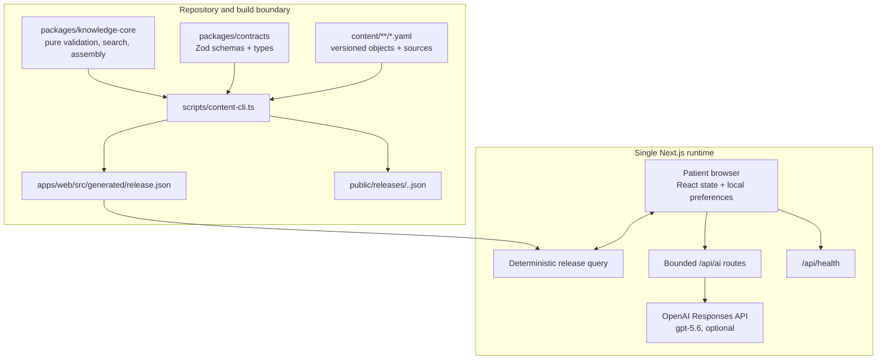

# Architecture

## Overview

Ariad is a small TypeScript monorepo with one deployable Next.js application and
two extractable knowledge packages. Clinical content is compiled at build time;
the runtime includes health reporting and two dormant, bounded OpenAI adapters.
The current owner-directed mode sets `ENABLE_GPT56=false`, so no provider call
is made. There is no database, graph database, vector store, CMS, or patient
backend.

## Boundaries by directory

### `apps/web`

- Next.js 16 App Router and React 19 patient experience.
- Mobile-first state machine covering home, treatment search/overview, symptom
  navigation, confirmation, observable questions, guidance, summary,
  unsupported fallback, and about/limits.
- Imports the generated release and validates it on startup.
- Server-only OpenAI adapter and routes; API credentials never enter browser
  code.
- Default-off, versioned local-storage adapter. Competition builds disable
  treatment saving and clear its legacy preference key.
- Static security headers and a health endpoint.

### `packages/contracts`

- Zod schemas for stable IDs, object versions, knowledge objects, review and
  approval evidence, release manifests, compiled releases, guidance, and AI
  request/results.
- Shared intended-use and universal emergency text.
- Strict v2 clinic configuration for identity, structured contact routes, and
  exact policy-to-module/contact bindings. Clinic data cannot override the
  universal emergency text, and the schema provides no patient-facing clinical
  instruction field.
- Strict objects reject extra fields at trust boundaries.

### `packages/knowledge-core`

- YAML/JSON repository loader in the Node-only entry point.
- Reference, graph, governance, and safety validation.
- Canonical JSON and deterministic SHA-256 release compilation.
- Search normalization, alias/fuzzy ranking, deterministic symptom matching.
- Transparently labelled exact/component/class/general guidance resolution and
  answer priority tags.
- Deterministic summary fallback and summary provenance validation.
- Pure runtime functions have no network or database dependency.

### `content`

- Human-reviewable treatment, symptom, feature, question, module,
  relationship, source, exact-version clinic, and release YAML.
- Generated JSON Schemas and Markdown review report.
- No runtime content mutation.

## Runtime routes

| Route | Responsibility | Explicitly excluded |
|---|---|---|
| `GET /api/health` | Service, release, and configured AI-state metadata | Patient data |
| `POST /api/ai/classify-symptom` | Structured selection from active symptom IDs, or deterministic fallback | Diagnosis, advice, guidance authoring |
| `POST /api/ai/create-symptom-summary` | Provenance-constrained restatement of supplied facts, or deterministic fallback | New facts, interpretation, grade, recommendations |

The AI routes validate request shape and length, apply same-origin and simple
rate controls, use a short timeout and no provider retries, avoid raw-input
logging, and return safe fallback envelopes when the model is disabled or
unavailable. The model receives no tool access, live search, retrieval context,
or persistent patient state.

## Release loading

`apps/web/src/lib/release.ts` imports the compiler output, parses it using the
strict `CompiledReleaseSchema`, and builds in-memory object lookups. The web app
cannot silently read a different content directory or mutable remote source at
runtime. Preview releases must carry a mandatory notice; the page is marked
`noindex`/`nofollow`.

The release envelope pins one clinic configuration by kind, ID, and exact
version. Runtime loading resolves that exact reference and fails if it is
missing or ambiguous; it never selects an ambient or first-listed clinic.
Clinic v2 exposes operational identity and structured contact routes to the
renderer. Synthetic values remain non-actionable; institutional values remain
hidden unless their verification is current at viewing time. Fever and supportive-care
bindings can point only to exact governed educational modules; the active
preview leaves both unresolved and therefore displays no clinic-authored
clinical instruction prose. P0 does not claim deployable configured-policy
rendering: publication fails closed until purpose compatibility and exact
runtime consumption are implemented.

## Technology choices

- TypeScript strict mode, pnpm workspaces.
- Next.js App Router and React.
- Zod and emitted JSON Schema.
- YAML for authored objects; Fuse.js for deterministic fuzzy search.
- Official OpenAI JavaScript SDK and Responses API Structured Outputs.
- Vitest for unit/golden tests; Playwright and axe for browser/accessibility
  tests.
- Tailwind tooling is installed, while the patient interface uses a compact
  purpose-built global style layer.
- Standalone Next.js Docker output and Vercel-compatible server routes.

## Deployment shape

The competition target is one Vercel application with server-side environment
variables and no database. The included multi-stage Dockerfile builds the same
standalone Next.js output as a non-root user. No public deployment is currently
claimed.

Draft preview builds require the exact explicit acknowledgement and preserve
the visible prototype notice. The competition target also forces
`NEXT_PUBLIC_ENABLE_TREATMENT_SAVING=false`. A future clinical deployment must
use a separate published, approved release; it must not enable draft content
through a generic boolean flag.

## Extractability

The knowledge contracts and pure compiler/query layer have no Next.js
dependency. Moving them into Nyx later should not require transferring patient
UI state or runtime OpenAI behavior. Ariad receives a governed release artifact
and remains downstream of review/publication authority.

See [data flow](./data-flow.md), [knowledge model](./knowledge-model.md), and
[architecture decisions](./adr/README.md).
