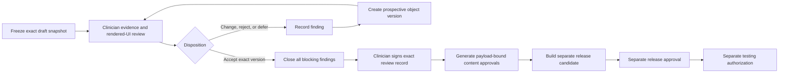

# Ariad: Breast clinician review brief

> Controlled review instructions. This document does not contain a clinical
> approval and does not authorize publication, deployment, patient testing, or
> clinical use.

## Document control

| Field | Value |
|---|---|
| Brief ID | `ARIAD-CRB-001` |
| Brief version | `1.0.0` |
| Issued | 2026-07-19 |
| Intended reviewer | Clinician owner and any independent clinical reviewer(s) |
| Review baseline commit | `a73de792a20da8a68d91081ccd1de3201b0c7df3` |
| Review baseline tree | `fe05bd2daf313e2b7bbdb26ff8ef460a7a31c05a` |
| Release | `build-week-preview-2026-07-18@0.2.0` |
| Compiled content hash | `80656c44ab5ab0707ae3417234c10415455e852fbd361e1ac05cd43363dafd4b` |
| Compiled JSON file SHA-256 | `22bdf0f9d69453747cbda3444b14843d05ef8096b6b2c681b878159aabee9c86` |
| Clinical-use state | `preview`; `clinical_use: false`; all governed objects `draft` |
| AI state | LLM disabled; deterministic content and navigation only |

The brief is added after the baseline commit. The clinical review remains bound
to the content and compiled release at the identifiers above. If any clinical
payload changes, freeze a new review baseline and do not reuse the old sign-off.

## 1. Purpose and authority boundary

The review has five objectives:

1. Determine whether each clinical statement is accurate and adequately
   supported by the cited source.
2. Determine whether the source applies to the stated treatment, regimen,
   population, jurisdiction, and intended setting.
3. Identify unsafe omissions, over-broad wording, ambiguity, or presentation
   that could reasonably be misunderstood as diagnosis, grading, personalized
   triage, prescribing, or treatment-change advice.
4. Verify that questions, answer choices, summaries, module selection, and
   emphasis remain descriptive and patient-observable.
5. Record exact, reproducible dispositions and the rationale for each decision.

Completion of this review may support approval of exact content-object versions
only. It does **not** authorize:

- publication or deployment;
- patient recruitment or testing;
- use of Ariad output in care;
- use of a real clinic identity or contact route;
- release approval;
- regulatory, privacy, research-ethics, or institutional approval; or
- a change to Ariad's locked intended use.

The locked boundary is that Ariad provides fixed educational information. It
must not diagnose, assign a toxicity grade, infer cause, calculate personal
urgency, recommend starting/stopping/holding/changing treatment, prescribe a
medicine, or replace the treating cancer team.

## 2. What constitutes a review decision

Use one of these dispositions for every reviewed row:

| Disposition | Meaning | Approval consequence |
|---|---|---|
| **Accept as written** | The exact text/value and its source mapping are acceptable for the stated scope. | May proceed to exact-payload approval after all blocking findings are closed. |
| **Change required** | A clinical, safety, evidence, jurisdictional, or clarity change is required. | Remains unapproved. Engineering creates a prospective version and returns it for review. |
| **Reject/remove** | The content or relationship should not be included in the reviewed scope. | Remains unapproved and must be removed from the later candidate or retired prospectively. |
| **Defer/external adjudication** | A local policy, specialty, source, or institutional decision is missing. | Remains unapproved and must be excluded from patient exposure. |
| **Not applicable** | The row is outside the explicitly declared review scope. | Confers no approval. |

There is no **approved with changes** disposition. Any change to the clinical
payload invalidates review of that exact version and requires re-review.

## 3. Choose and declare the review scope

The reviewer must select one scope in the review record before starting:

### A. Pathway-scoped review

Review one or more exact pathways and exclude everything else from a later
study-specific release. This is the recommended first pass. The lowest-risk
starting scope is weekly paclitaxel preparation plus weekly
paclitaxel/peripheral neuropathy.

A pathway review includes every visible or behavior-driving object for that
pathway: treatment/regimen terms, symptom terms, observable features,
questions, answer options, summary text, educational modules, relationship,
sources, safety constants, and rendered presentation.

### B. Full current-release review

A published version of the current broad release would require review and
approval of all **130 governed objects**, not only the 22 educational modules.

| Group | Count | Required clinical check |
|---|---:|---|
| Treatment classes, drugs, regimens, and symptoms | 66 | Names, aliases, components, routes, applicability, and support labels |
| Observable features and questions | 38 | Patient observability, wording, answer choices, summaries, and absence of implicit grading/triage |
| Educational modules | 22 | Every paragraph, bullet, claim handle, source, warning, and applicability mapping |
| Treatment–symptom relationships | 3 | Correct treatment/symptom pair, question set, six module slots, and support state |
| Clinic configuration | 1 | Separation of identity/operations from clinical policy; current synthetic and unresolved status |

The release also includes 14 source records. Twelve are marked `verified` by
the repository and two broad directories are `link_only`. Repository source
status is not clinician verification.

If the clinician does not explicitly review all 130 governed objects, the
sign-off must identify the accepted exact objects and state that the remaining
objects are unreviewed. Do not use a blanket statement such as “the app is
approved.”

The clinician owner may perform the primary review. Before patient exposure,
an independent second clinical review is strongly recommended for numeric
thresholds, emergency/escalation wording, medication-related omissions, and
cross-jurisdiction policy decisions. The second review must have its own named
scope and evidence; it is not implied by the primary sign-off.

## 4. Review workflow



### Before reviewing

1. Record the reviewer’s full name, clinical credentials, professional role,
   jurisdiction, and conflict-of-interest declaration.
2. Confirm the exact baseline identifiers in the Document control table.
3. Confirm the UI identifies the release hash in its About/source information.
4. Use synthetic scenarios only. Do not enter a patient name, health number,
   date of birth, contact information, real symptom narrative, or other PHI.
5. Open the authored YAML and the rendered application. Neither is sufficient
   alone.
6. Open sources from the official-source register below. Do not rely on the
   repository's `verified` label or this brief as a substitute for checking the
   source yourself.
7. Use the separate [clinician review record
   template](./templates/clinician-review-record-template.md) for findings and
   sign-off. Do not write review results into this instruction document.

### For every clinical statement or structured value

1. Identify the exact object reference: `kind:id@version`.
2. Identify the exact field or location, such as `paragraphs.0`, `bullets.2`,
   `prompt`, `options[value=yes].summary_text`, `applicability`, or
   `support_status`.
3. Open each cited source and confirm:

   - issuing organization and official domain;
   - exact title and document identity;
   - jurisdiction;
   - publication/revision/version and live status;
   - relevant page, section, heading, table, or paragraph; and
   - whether a newer official document supersedes it.

4. Classify support as `direct`, `partial`, `context only`, `conflicting`, or
   `not supported`.
5. Confirm the Ariad wording is a faithful, context-preserving paraphrase and
   is no stronger than the source.
6. Confirm applicability to the exact regimen/schedule, tumour setting,
   population, and jurisdiction. Record any extrapolation.
7. Check whether an omitted qualification would make the statement misleading
   or unsafe.
8. Compare conflicting sources explicitly. Preserve both alternatives,
   contexts, and dates; record the selected wording and clinical rationale.
9. Check the wording against the prohibited-function boundary.
10. Review the statement in its rendered sequence, including title, adjacent
    sections, source panel, answer-driven emphasis, and generated neutral
    summary.
11. Record a disposition and finding severity. Do not rely on verbal feedback.

### Evidence sufficiency standard

An accepted row should have enough information for a second reviewer to repeat
the check without guessing. Record at least:

- object, version, and exact field;
- claim ID when one exists;
- source ID and source version;
- precise source locator;
- short evidence rationale in the reviewer’s own words;
- jurisdiction/regimen/population assessment;
- currentness/supersession check;
- disposition and date.

The current `claim_ids` are review handles, not first-class claim objects. A
module has a list of claim IDs and a list of source IDs, but no explicit
claim-to-sentence-to-source mapping. The reviewer must create that mapping in
the review record. Do not assume every listed source supports every sentence.

Avoid copying authoritative documents wholesale. A locator and concise
rationale are preferred. If an official PDF is retained as controlled evidence,
store it only where authorized and record its SHA-256; do not commit it to a
public repository merely for convenience.

## 5. Source hierarchy and verification register

For the current Ontario-oriented scope, use this hierarchy:

1. Ontario Health / Cancer Care Ontario for Ontario patient and regimen
   instructions.
2. Health Canada product and safety information for Canadian label/safety
   cross-checking.
3. BC Cancer as a Canadian cross-check where Ontario material is incomplete.
4. eviQ as an Australian cross-check, never as silent Ontario policy.
5. A verified institutional policy for local thresholds, destinations, and
   contact instructions.

For a non-Ontario source, record one of `applicable`, `applicable with
qualification`, or `not applicable`, with a rationale.

All source IDs below were present in release `0.2.0`. A live source audit on
2026-07-19 found metadata defects and a missing newer guideline. The clinician
must re-open and verify every source on the actual review date; the affected
source records must be corrected prospectively before approval.

### Source-registry issues already identified

1. `eviq-infection-during-cancer-treatment@1.0.0` is mis-versioned. Its old
   asset URL contains `V5-02` but now serves current-looking version 6 content.
   The official landing/history page identifies ID 3098 v6, changed 17 February
   2025, with review due 30 June 2026. The review-due date has passed.
2. Ontario Guideline 12-15 remains administratively `Current` because a
   November 2025 assessment deferred review. Its cover directs readers to the
   newer November 2021 febrile-neutropenia guideline GL-C50-27, which is not in
   Ariad's source inventory.
3. The capecitabine Drug Product Database record is manufacturer-, DIN-, and
   strength-specific. It should not be represented as a generic product
   monograph without that identity.
4. Several repository display titles are approximate. The clinician should use
   the official titles below and record any metadata correction as a finding.
5. The two broad Ontario directory records remain `link_only`; neither can
   substantiate an individual clinical claim.
6. `cco-manage-diarrhea` is patient-facing information despite its current
   `clinical_guidance` source-type label; confirm or correct that classification
   prospectively.

| Source ID | Official source and recorded version | Used for | Clinician verification focus |
|---|---|---|---|
| `cco-paclitaxel-patient-information` | [Ontario Health PACLitaxel – Patient Info Sheet / Medication Information Sheet](https://www.cancercareontario.ca/en/drugformulary/drugs/infosheet/44151); revised June 2024 | Paclitaxel route/effects, neuropathy, functional examples, urgent neurological signs | Confirm live revision, every mapped symptom/function claim, and whether emergency signs belong in this pathway. Exact revision day is not recorded. |
| `eviq-weekly-paclitaxel-breast-patient-information` | [eviQ weekly paclitaxel](https://www.eviq.org.au/medical-oncology/breast/neoadjuvant-adjuvant/4103-breast-neoadjuvant-adjuvant-paclitaxel-weekly/patient-information); last reviewed 5 June 2024; review due 31 December 2028 | Weekly regimen, preparation, effects, neuropathy precautions | Decide whether Australian neoadjuvant/adjuvant content supports the intended Canadian scope; do not import its fever/diarrhea criteria without adjudication. |
| `bc-cancer-peripheral-neuropathy-handout` | [BC Cancer Peripheral Neuropathy: Nerve damage from chemotherapy PDF](https://www.bccancer.bc.ca/managing-symptoms-site/Documents/Peripheral-Neuropathy.pdf); February 2020 | Neuropathy description, function, injury/fall precautions, driving | Check currentness and practical safety wording. The PDF metadata names an old fatigue source, and supplement suggestions are intentionally excluded. |
| `cco-capecitabine-patient-information` | [Ontario Health CAPE – Patient Infosheet / CAPE Treatment](https://www.cancercareontario.ca/en/drugformulary/regimens/infosheet/45016); created 2023; December 2023 note applies to the pregnancy section | Capecitabine/diarrhea relationship, home measures, contact observations | Verify the exact bowel-frequency and 24-hour criteria. Do not treat the December note as a full-document revision date. Explicit dosing and treatment-hold instructions are intentionally absent from Ariad and require an omission-safety decision. |
| `cco-manage-diarrhea` | [Ontario Health How to Manage Diarrhea: For People With Cancer](https://www.cancercareontario.ca/en/guidelines-advice/symptom-management/diarrhea/how-to-manage-diarrhea); updated June 2025 | Definition, hydration/diet/skin care, warning signs, escalation | Verify every numeric criterion, medicine qualifier, dehydration sign, fever cross-reference, and any setting-specific limitation; disposition the current source-type label. |
| `health-canada-capecitabine-product-record` | [Health Canada DPD record](https://health-products.canada.ca/dpd-bdpp/info?code=100911&lang=eng) and [official monograph](https://pdf.hres.ca/dpd_pm/00084593.PDF); CAPECITABINE 150 mg, DIN 02519879, JAMP Pharma; monograph revised 1 May 2026 | Label and safety cross-check at regimen/relationship level | Confirm current market status, sponsor/DIN/strength, monograph identity, and whether this product-specific record is appropriate for the intended scope. Review diarrhea, DPD, serious-warning, and patient-information sections. No patient module cites it directly. |
| `health-canada-fluoropyrimidine-infowatch` | [Health Canada Health Product InfoWatch, March 2025](https://www.canada.ca/en/health-canada/services/drugs-health-products/medeffect-canada/health-product-infowatch/march-2025.html); page dated 27 March 2025 | Severe fluoropyrimidine toxicity/DPD safety cross-check | Identify the exact claim it supports and decide whether omitting DPD, serious-toxicity, immediate-help, or treatment-hold information leaves an unsafe gap within Ariad's non-prescribing boundary. |
| `cco-ac-breast-patient-information` | [Ontario Health AC – Patient Infosheet / AC Treatment](https://www.cancercareontario.ca/en/drugformulary/regimens/infosheet/46111); May 2016 | AC components and infection context | Decide whether this legacy source remains acceptable. It describes a 21-day AC schedule; current Ariad deliberately omits schedule/nadir timing. |
| `cco-fever-patient-guide` | [Ontario Health How to tell if you have a Fever PDF](https://www.cancercareontario.ca/system/files_force/symptoms/CCOFeverPostcard.pdf?download=1); undated | Thermometer preparation, medicine masking, fever wording | Verify source identity/currentness and the Ontario oral-temperature alternatives. Do not assign the 2015 guideline date to this undated PDF. It does not establish a clinic's local destination. |
| `cco-fever-assessment-guideline` | [Ontario Health Approach to Fever Assessment in Ambulatory Cancer Patients Receiving Chemotherapy](https://www.cancercareontario.ca/en/guidelines-advice/types-of-cancer/1376); report dated 27 November 2015; November 2025 review deferred | Fever assessment context | Review the deferral notice and the exact population/setting. Do not accept this source alone without checking GL-C50-27 and any newer institutional policy. |
| **Missing from registry** | [Ontario Health Prevention and Outpatient Management of Febrile Neutropenia in Adult Cancer Patients, GL-C50-27](https://www.cancercareontario.ca/en/guidelines-advice/types-of-cancer/38561); November 2021 | Updated febrile-neutropenia recommendations referenced by Guideline 12-15 | Add a prospective source record or document why it is not applicable; review it before approving infection/fever content. |
| `eviq-dose-dense-ac-breast-patient-information` | [eviQ dose-dense AC](https://www.eviq.org.au/medical-oncology/breast/neoadjuvant-adjuvant/4102-breast-neoadjuvant-adjuvant-ac-doxorubicin-a/patient-information); last reviewed 5 December 2023; review due 31 December 2027 | AC/infection cross-check | This is dose-dense AC and uses Australian fever wording. Do not treat it as proof for a generic AC schedule or Ontario policy. |
| `eviq-infection-during-cancer-treatment` | [eviQ ID 3098 landing/history](https://www.eviq.org.au/patients-and-carers/patient-information-sheets/managing-side-effects/3098-infection-during-cancer-treatment) and [current v6 PDF](https://www.eviq.org.au/getmedia/474a3ca7-e4da-4e2b-95ee-e026cd10028a/ID-3098-Infection-during-cancer-treatment-2025-V-6.pdf.aspx?ext=.pdf); changed 17 February 2025; review due 30 June 2026 | Observable infection signs and thermometer preparation | Current repository metadata says v5.02 and is stale. The review due date has passed. Verify landing-page history, downloaded artifact hash, clinical meaning, and cross-jurisdiction applicability before reliance. |
| `cco-systemic-treatment-information` | [Ontario Health Drug Formulary landing page](https://www.cancercareontario.ca/en/cancer-treatments/chemotherapy/drug-formulary); current directory; `link_only` | Broad treatment catalogue provenance | Directory presence is not direct evidence for a specific drug claim. Replace with exact evidence or exclude dependent catalogue objects from a published candidate. |
| `cco-symptom-management-directory` | [Ontario Health symptom-management directory](https://www.cancercareontario.ca/en/symptom-management); current directory; `link_only` | Broad symptom catalogue provenance | Directory presence is not direct evidence for a specific symptom claim. Replace with exact evidence or exclude dependent catalogue objects from a published candidate. |

For every source, record the actual access date and whether the metadata above
still matches. If not, stop and update the source record prospectively before
approval.

## 6. Educational-module review inventory

All 22 modules below are version `1.0.0`, `draft`, with no reviewer, review
date, or approval. Review the exact text in `content/modules/`, not only the
summary in this brief.

### Weekly paclitaxel preparation

| Module | Claim handles | Sources | Required review focus |
|---|---|---|---|
| `weekly-paclitaxel-prep-overview` | `claim-weekly-paclitaxel-regimen` | eviQ paclitaxel; CCO paclitaxel | Regimen description, IV route, breast setting, and whether neoadjuvant/adjuvant evidence supports broader wording. |
| `weekly-paclitaxel-prep-possible-effects` | `claim-paclitaxel-possible-effects` | eviQ paclitaxel; CCO paclitaxel | Balance and completeness of tiredness, nausea, hair loss, blood-count/infection concerns, and neuropathy; ensure the short list does not imply exclusivity. |
| `weekly-paclitaxel-prep-practical` | `claim-treatment-preparation-checklist` | eviQ paclitaxel; CCO fever guide | Contacts, thermometer, medicine list, team instructions, and whether each item is appropriate before and during weekly treatment. |
| `weekly-paclitaxel-prep-warning-boundary` | `claim-ariad-boundary`; `claim-universal-emergency-boundary` | CCO paclitaxel; CCO fever guide | Comprehension of the fixed/non-personalized boundary. Treat the emergency sentence as a product safety constant as well as displayed clinical wording. |

### Paclitaxel and peripheral neuropathy

| Module | Claim handles | Sources | Required review focus |
|---|---|---|---|
| `neuropathy-about` | `claim-neuropathy-description`; `claim-neuropathy-function` | CCO paclitaxel; eviQ paclitaxel; BC neuropathy | Symptom description, functional domains, other-cause qualification, and non-diagnostic boundary. |
| `paclitaxel-neuropathy-context` | `claim-paclitaxel-neuropathy-association`; `claim-neuropathy-hand-function` | CCO paclitaxel; eviQ paclitaxel | Association and examples without implying causation in an individual. |
| `neuropathy-home-safety` | `claim-neuropathy-injury-prevention`; `claim-neuropathy-fall-prevention` | eviQ paclitaxel; BC neuropathy | Skin checks, shoes/gloves, bath water, clutter/lighting, driving, missing qualifiers, and practical accessibility. |
| `neuropathy-contact-team` | `claim-neuropathy-contact-observations` | CCO paclitaxel; eviQ paclitaxel; BC neuropathy | New/worsening symptoms and functional effects; whether contact timing is clear without becoming personalized triage. |
| `neuropathy-urgent-neurological-signs` | `claim-urgent-neurological-signs` | CCO paclitaxel | Direct support for each sign and whether stroke/seizure-type warnings in a neuropathy path could confuse or misdirect users. |
| `neuropathy-reporting-checklist` | `claim-neuropathy-reporting-information` | CCO paclitaxel; BC neuropathy | Completeness and neutrality of location, onset, change, function, falls/injuries, and last-treatment facts. |

### Capecitabine and diarrhea

| Module | Claim handles | Sources | Required review focus |
|---|---|---|---|
| `diarrhea-about` | `claim-diarrhea-description` | CCO CAPE; CCO diarrhea | Definition, baseline-relative wording, associated features, and non-causal boundary. |
| `capecitabine-diarrhea-context` | `claim-capecitabine-diarrhea-association`; `claim-diarrhea-fluid-loss` | CCO CAPE; CCO diarrhea; Health Canada InfoWatch | Association, fluid/electrolyte framing, serious-toxicity context, and whether each source supports the exact sentence. |
| `diarrhea-home-management` | `claim-diarrhea-tracking`; `claim-diarrhea-hydration`; `claim-diarrhea-foods`; `claim-diarrhea-team-directed-medicine` | CCO CAPE; CCO diarrhea | Every measure and qualifier; fluid restrictions; diet wording; perianal care; and acceptability of team-directed OTC wording. |
| `diarrhea-contact-team` | `claim-diarrhea-contact-observations` | CCO CAPE; CCO diarrhea | Bowel-frequency and 24-hour criteria, dehydration/warning signs, terminology, and the discrepancy adjudication below. |
| `diarrhea-urgent-attention` | `claim-diarrhea-urgent-fallback`; `claim-fever-threshold-owner-pending` | CCO diarrhea; CCO fever guide | Currently contains an unresolved fever placeholder. It cannot be accepted as a complete clinical-use module in its present form. |
| `diarrhea-reporting-checklist` | `claim-diarrhea-reporting-information` | CCO CAPE; CCO diarrhea | Onset/count/baseline, associated symptoms, hydration, medicine, and last-dose facts; ensure “last dose” does not imply a treatment hold. |

### AC and fever/infection concern

| Module | Claim handles | Sources | Required review focus |
|---|---|---|---|
| `fever-infection-about` | `claim-infection-observable-signs`; `claim-infection-without-fever` | CCO fever guide; eviQ infection | Infection signs, infection without fever, and the distinction between observations and laboratory status. |
| `ac-fever-infection-context` | `claim-ac-components`; `claim-chemotherapy-infection-risk` | CCO AC; eviQ dose-dense AC | AC components, white-cell/infection language, and whether dose-dense evidence is appropriate for generic unresolved AC. |
| `infection-home-preparation` | `claim-thermometer-readiness`; `claim-fever-medicine-masking`; `claim-infection-precautions` | CCO fever guide; eviQ infection | Temperature technique, medicine masking, hand hygiene, cut/line care, and any over-generalization. |
| `infection-contact-team` | `claim-infection-contact-observations` | CCO AC; eviQ infection | Observable signs, uncontrolled vomiting/diarrhea, feeling unwell without fever, and contact timing. |
| `infection-urgent-attention` | `claim-infection-urgent-observations`; `claim-fever-threshold-owner-pending` | CCO fever guide; CCO fever guideline; eviQ infection | Currently contains an unresolved threshold/destination placeholder. It cannot be accepted as a complete clinical-use module in its present form. |
| `infection-reporting-checklist` | `claim-infection-reporting-information` | CCO AC; CCO fever guide; eviQ infection | Temperature/method/times, symptom list, last AC date, and fever-medicine timing; last-treatment timing must remain descriptive. |

## 7. Questions, observable features, and summaries

Review the paired objects in both `content/features/gold-scenarios.yaml` and
`content/questions/gold-scenarios.yaml`.

| Pathway | Feature IDs | Question IDs |
|---|---|---|
| Neuropathy | `neuropathy-location`, `neuropathy-onset`, `neuropathy-trend`, `neuropathy-hand-tasks`, `neuropathy-walking-balance`, `neuropathy-weakness` | Same IDs prefixed with `q-` |
| Diarrhea | `diarrhea-onset`, `diarrhea-count`, `diarrhea-baseline-change`, `diarrhea-drinking`, `diarrhea-vomiting`, `diarrhea-dizziness`, `diarrhea-temperature`, `diarrhea-blood` | Same IDs prefixed with `q-` |
| Fever/infection | `infection-temperature`, `infection-chills`, `infection-feeling-unwell`, `infection-signs`, `infection-fever-medicine` | Same IDs prefixed with `q-` |

For each feature/question pair, check:

- the concept is directly patient-observable;
- the prompt does not ask for diagnosis, attribution, grading, or a care
  decision;
- answer choices are understandable, clinically meaningful, sufficiently
  complete, and not misleadingly reassuring;
- multi-select “none” behavior cannot create a contradictory response;
- the summary text restates the answer without interpretation;
- priority tags only affect the order/emphasis of fixed modules and are not
  likely to be perceived as an urgency score;
- optional free text is tightly scoped and does not invite PHI or an open-ended
  symptom narrative; and
- question order does not imply that the answers will produce personal triage.

`q-diarrhea-baseline-change@1.0.0` and its feature are pinned in the release,
but the question is **not** used by the `capecitabine-diarrhea@1.0.0`
relationship. The reviewer must disposition whether it should be added,
removed from a narrowed release, or remain intentionally unused. Its answer
thresholds must also be reconciled with the absolute bowel-count question and
the selected source policy.

## 8. Relationships, applicability, and catalogue semantics

Review all three complete relationships:

- `weekly-paclitaxel-peripheral-neuropathy@1.0.0`;
- `capecitabine-diarrhea@1.0.0`; and
- `ac-fever-infection-concern@1.0.0`.

Confirm the exact treatment–symptom association, source list, question list,
six module slots, and `full_guidance` label.

Also decide whether current module applicability is too broad:

- Neuropathy modules apply to both `weekly-paclitaxel` and generic
  `paclitaxel`, while the complete runtime relationship is weekly-regimen
  specific.
- Diarrhea modules apply to both `capecitabine-monotherapy` and generic
  `capecitabine`, while the complete runtime relationship is monotherapy
  specific.
- The AC relationship is generic `ac`, but the evidence includes both a
  21-day Ontario source and an Australian dose-dense source.

For every treatment, drug, symptom, class, and alias visible in a reviewed
scope, confirm that the label is clinically accurate and that
`full_guidance`, `education_only`, `catalogued`, or `unsupported` communicates
the actual coverage. Catalogue presence must not imply that Ariad provides a
reviewed management pathway.

## 9. Mandatory adjudications

### 9.1 Fever threshold, measurement, and destination

The current release intentionally provides no local fever threshold or
destination. Ontario material describes oral-temperature alternatives, while
eviQ uses a different criterion. Before approving any fever-bearing pathway,
record:

- the exact source/version for every candidate criterion;
- temperature threshold(s), measurement site, persistence/repeat condition,
  and timing;
- whether the criterion is general education or an institutional policy;
- who the patient contacts during daytime and after hours;
- when the destination is the cancer team versus emergency care;
- the applicable institution and jurisdiction;
- the selected wording and rationale; and
- whether the path is excluded until institutional onboarding.

A clinical wording decision alone does not verify a telephone number or
operational destination. Those require separate clinic-owner verification.

### 9.2 Diarrhea count and escalation discrepancy

The current Ontario sources use more than seven bowel movements in 24 hours in
the relevant patient instructions. The eviQ weekly-paclitaxel page uses a
different four-or-more criterion in a different treatment and jurisdiction.
The repository names an Ontario/eviQ discrepancy but does not yet contain a
structured discrepancy record or a dedicated eviQ diarrhea source.

The reviewer must document:

- exact competing sources, versions, wording, treatment context, and
  jurisdiction;
- `more than seven` versus the question option `7 or more`;
- absolute count versus change from the patient's baseline;
- duration and response-to-medicine qualifiers;
- dehydration, blood, pain, fever, and inability-to-drink modifiers;
- whether capecitabine-specific instructions differ from generic chemotherapy
  instructions; and
- the selected wording, exclusions, and rationale.

Do not silently average, harmonize, or choose the most conservative number
without documenting why it is correct for the stated scope.

The current Health Canada capecitabine monograph contains treatment-interruption
criteria that are lower than the patient-contact threshold used in the Ontario
patient sheet. Treat these as different decisions—medicine management versus
patient-facing contact education—and document whether omitting the former is
safe within Ariad's intended-use boundary.

### 9.3 Anti-diarrheal and other medicine wording

Decide whether “only as your cancer team instructed” is sufficient, whether an
explicit source-controlled medicine module is needed, and whether omission of
capecitabine hold/immediate-help instructions creates a safety gap. Ariad must
not independently prescribe a dose or recommend a treatment change. If safe
wording depends on local instructions, defer it to a governed institutional
policy rather than inventing a generic rule.

### 9.4 Exact AC variant

The Ontario AC source describes a 21-day schedule; the eviQ source is
dose-dense. The current regimen is tagged `exact-schedule-unresolved`, and no
nadir or cycle-day inference is permitted. Either:

- keep the pathway timing-neutral and document why its claims apply across the
  stated variants;
- narrow the regimen to one exact schedule and source set; or
- defer the pathway.

### 9.5 Neurological emergency wording

Confirm that sudden confusion, trouble speaking, sudden limb movement
difficulty, seizure, and loss of consciousness are directly supported and
appropriate in a neuropathy pathway. Consider whether their placement could
cause patients to mistake general emergency education for a neuropathy grade
or paclitaxel-specific diagnosis.

### 9.6 Cross-jurisdiction and source-age decisions

Record explicit decisions for:

- Australian eviQ content used in Canada/Ontario modules;
- BC Cancer content used in Canada-wide wording;
- the 2015 Ontario fever guideline;
- the newer 2021 Ontario febrile-neutropenia guideline missing from the current
  source inventory;
- the legacy Ontario AC material; and
- the February 2020 BC neuropathy handout; and
- the overdue eviQ infection document and its stale repository version record.

## 10. Rendered experience review

For every in-scope path, complete the review once in authored YAML and once in
the rendered UI.

1. Search for and select the exact regimen.
2. Confirm the support label does not overstate coverage.
3. Search for and confirm the symptom.
4. Complete every answer branch using synthetic values, including `unsure`,
   `none`, high-risk observations, and optional blank fields.
5. Confirm answers only reorder or emphasize existing modules.
6. Read the six sections in context and confirm headings do not change the
   clinical meaning.
7. Confirm the cause/grade/personal-urgency limitation is persistent.
8. Confirm the universal emergency statement is visible and not suppressible.
9. Inspect source/review panels for accurate approval and source status.
10. Generate the neutral summary and verify it contains facts only, including
    uncertainty where selected.
11. Check copy, print, download, and reset behavior without entering PHI.
12. Exercise an unsupported and a mismatched treatment/symptom path.

Record screenshots only if they contain synthetic data. Identify each by
commit, release hash, browser/device, and date.

## 11. How to provide feedback

Use one finding per independently resolvable issue in the review record. A
finding must contain:

- stable finding ID, for example `CRB-001-F001`;
- exact object and field;
- exact text/value being reviewed;
- claim handle, if present;
- source ID/version and locator;
- support classification;
- clinical and jurisdictional rationale;
- severity;
- disposition;
- requested change, if any; and
- downstream objects or rendered paths that may be affected.

Severity definitions:

| Severity | Definition | Required response |
|---|---|---|
| **Blocker** | Plausible patient harm; incorrect emergency/contact criterion; unsupported factual claim; wrong treatment/regimen/jurisdiction; prohibited diagnosis/triage/treatment advice; missing critical qualification. | Exclude or correct before approval or patient exposure. |
| **Major** | Potentially misleading, materially incomplete, ambiguous, or poorly supported, without an immediate identified harm mechanism. | Correct and re-review before approval. |
| **Minor** | Clarity or completeness issue unlikely to change a care-related interpretation. | Correct prospectively; exact changed version still requires re-review. |
| **Editorial** | Grammar, spelling, or style only. | Exact changed payload still requires final verification. |

Engineering should respond to each finding with `accept`, `reject with
rationale`, or `clarification requested`. Clinical changes belong in source
YAML, never in `apps/web/src/generated/release.json`. After changes,
engineering must create a new object version where required, run validation
and tests, freeze a new candidate, and return the changed item and affected
rendered context for re-review. A finding closes only when the clinician marks
`closed—verified` against the exact new version.

## 12. Formal sign-off

### 12.1 Human review attestation

After all blocker and major findings in the declared scope are closed, complete
and sign the review record using an institutionally acceptable signature
method. A typed name in Git is traceable but is not, by itself, authenticated
clinical credential evidence. Where needed, retain a signed PDF or electronic
signature audit record in an authorized evidence store and record its evidence
ID and SHA-256 in the repository review record. Do not store sensitive
credential documents in a public repository.

The attestation must state:

> I, [full name and credentials], reviewed the exact objects and source versions
> listed in Clinical Review Record [ID/version]. I verified each accepted
> statement against the documented source location, considered jurisdiction,
> regimen, population, and setting applicability, and assessed the wording and
> rendered context against Ariad's locked intended use and prohibited-function
> boundary. All blocking findings within my stated scope are closed. My
> acceptance applies only to the listed object versions and clinical payload
> hashes. It does not authorize release publication, deployment, patient
> testing, clinical use, or use outside the stated scope. Review due: [date or
> explicit trigger-based policy].

The signed record must also include:

- reviewer identity, credentials, role, jurisdiction, and conflict statement;
- review scope and explicit exclusions;
- baseline commit, tree, release, and content hash;
- exact accepted object inventory;
- source verification log and access dates;
- closed and unresolved findings;
- review date/time with offset;
- review-due date or explicit trigger policy; and
- signature method, evidence reference, and evidence hash where applicable.

### 12.2 Schema-backed content approval

Human attestation is evidence for, but is not identical to, repository content
approval. Each accepted object ultimately requires a separate payload-bound
approval record:

```yaml
kind: content_approval
id: <stable-approval-id>
subject:
  kind: <object-kind>
  id: <object-id>
  version: <exact-version>
subject_payload_hash: <exact-64-character-clinical-payload-sha256>
decision: approved
reviewer: <real-reviewer-name>
reviewed_at: <actual-ISO-8601-time-with-offset>
review_due: <YYYY-MM-DD-or-null>
```

The corresponding object must transition through `draft → in_review →
approved` with actual times, people, and reasons, and must reference the exact
approval ID. Never manufacture metadata or backdate a transition.

For an educational module, keep the governed review due date, the module-level
`review_due`, and the approval-record `review_due` consistent. The current
validator does not prove that those three values agree.

### 12.3 Current tooling limitation

The clinician can conduct and sign the substantive review now, but the current
repository does **not** yet have a safe operator command to:

- produce a complete review matrix for all 130 governed objects;
- map each claim to an exact source locator;
- generate per-object clinical payload hashes and approval scaffolds;
- authenticate reviewer identity or attach signed evidence;
- produce a pre-approval release-candidate hash safely; or
- record testing authorization, publication, deployment, or rollback events.

Do not manually guess payload hashes or mass-change objects to `approved`.
Before translating a signed clinical record into repository approvals, add and
independently verify deterministic review-packet/approval-scaffold tooling.

### 12.4 Separate later gates

1. **Content approval:** exact individual objects and payload hashes.
2. **Release approval:** the complete candidate and its content hash.
3. **Publication/deployment:** the exact approved artifact in an exact
   environment, with rollback and monitoring.
4. **Testing authorization:** exact protocol, participant group, site, ethics
   determination, consent/privacy package, study build hash, dates, conditions,
   stopping rules, and authorizing person.
5. **Clinical use:** a separate institutional and regulatory authorization.

No earlier gate implies a later one.

## 13. Re-review triggers

Re-review is required when any of the following occurs:

- any accepted clinical payload changes, including an editorial change;
- a cited source is updated, retired, unavailable, or superseded;
- a new source changes the balance of evidence;
- treatment, schedule, setting, population, or jurisdiction changes;
- clinic policy, threshold, destination, or contact information changes;
- question wording, options, summary text, priority tags, module order, or
  rendering changes in a way that could affect interpretation;
- the intended use or prohibited-function boundary changes;
- LLM functionality is re-enabled or changes a patient-visible clinical
  interaction;
- a usability finding, incident, near miss, complaint, or surveillance signal
  challenges an accepted assumption; or
- the chosen review-due date arrives.

## 14. Repository review materials

- [Current generated review queue](../content/review-report.md)
- [Clinical content governance](./content-governance.md)
- [Clinical safety boundary](./clinical-safety.md)
- [Locked intended use](./intended-use.md)
- [Clinic configuration boundary](./clinic-configuration.md)
- [Knowledge model](./knowledge-model.md)
- [Official source records](../content/sources/official.yaml)
- [Educational modules](../content/modules/)
- [Questions](../content/questions/gold-scenarios.yaml)
- [Observable features](../content/features/gold-scenarios.yaml)
- [Treatment–symptom relationships](../content/relationships/gold-scenarios.yaml)
- [Release manifest](../content/releases/build-week-preview.yaml)
- [Clinician review record template](./templates/clinician-review-record-template.md)
