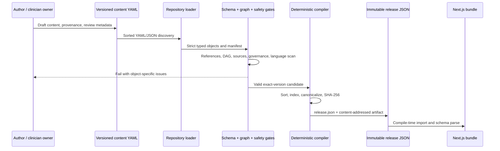
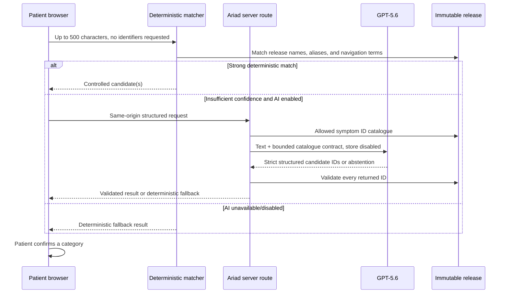
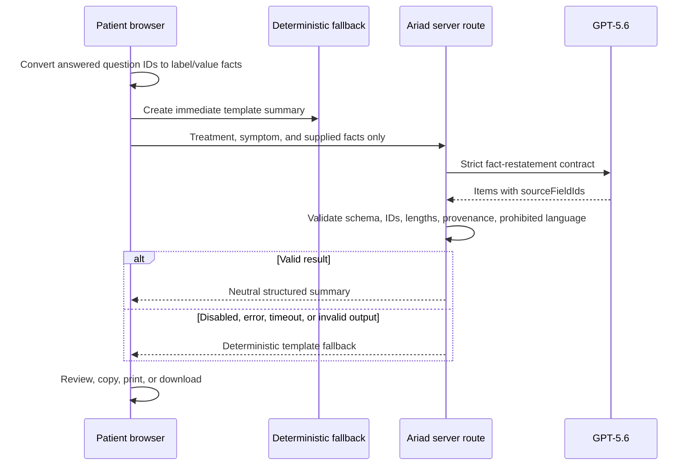

# Data flow

## 1. Build-time content flow



The compiler never approves content. The current preview path additionally
requires the exact unreviewed-content acknowledgement and emits
`clinical_use: false` plus a mandatory notice. A normal build fails because no
published release exists.

## 2. Treatment and symptom search

Treatment and symptom indexes are generated from the active release. Browser
search normalizes the query and ranks exact name, exact alias, prefix, token,
and fuzzy matches. Results include the authored support status.

Selecting a catalogue item does not synthesize a relationship. If the exact
treatment/preparation or treatment–symptom path is missing, Ariad presents an
unsupported boundary and alternative search options.

## 3. Natural-language symptom navigation



The model does not receive clinical modules and cannot enter the guidance path
without patient confirmation.

## 4. Questions and guidance

After category confirmation, the browser selects treatment context and asks the
pure resolver for the most specific eligible complete relationship. The
resolver's order is exact, regimen component, nearest treatment class, then
general safety, with a visible basis/reason for every fallback. The active
preview has complete content only for three exact combinations. A resolved
relationship's 3–7 question IDs determine the observable form. Answers live in
React state.

```text
observable answer
  → authored option summary text
  → authored priority tags
  → module emphasis/initial expansion
  → unchanged fixed six-section guidance
```

There is no scoring, toxicity grade, causal inference, urgency category, or
treatment recommendation. Clinical paragraphs and bullets come only from the
compiled modules.

## 5. Neutral summary



The summary is not written to a database or server history. The application
does not create a longitudinal record.

## 6. Persistence and reset

Only a versioned local-storage object persists:

```json
{
  "schemaVersion": 1,
  "savedTreatmentIds": ["weekly-paclitaxel"],
  "noticeAcknowledged": false
}
```

It is capped at 12 treatment IDs. Free text, answers, candidate matches, and
summary content remain in active React state and are cleared by reset or normal
session termination. “Reset demo and clear saved treatments” removes the local
storage key and ephemeral state.

When GPT-5.6 is enabled, the minimum request data crosses the server/provider
trust boundary. Users are explicitly asked not to enter identifying
information; this prototype is not authorized for PHI.

See [threat model](./threat-model.md) and [architecture](./architecture.md).
