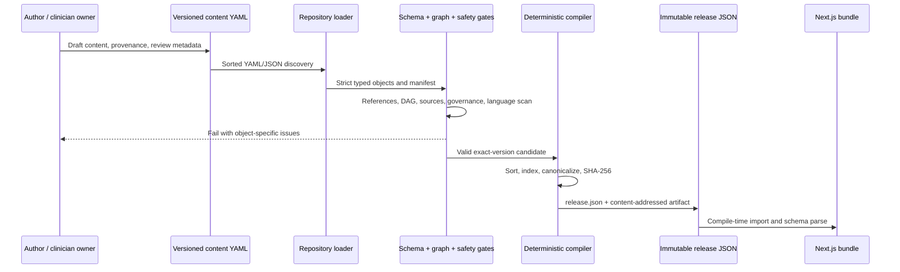
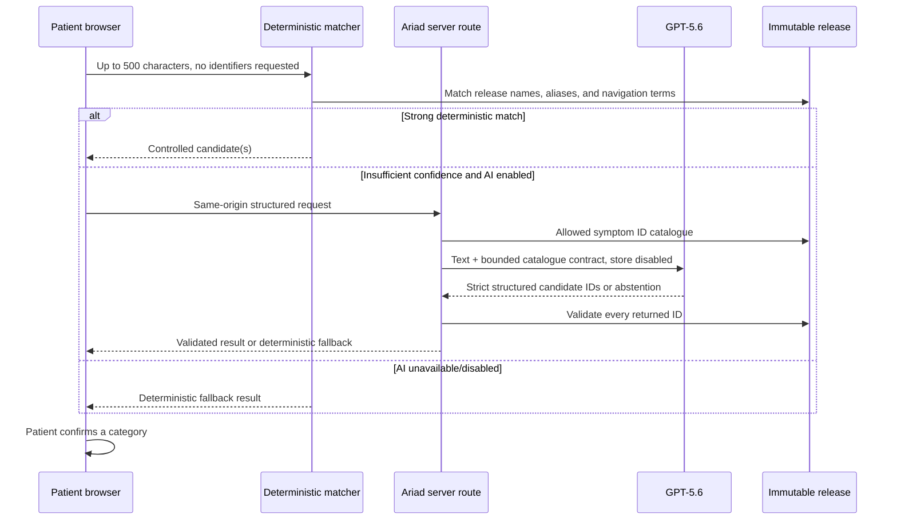
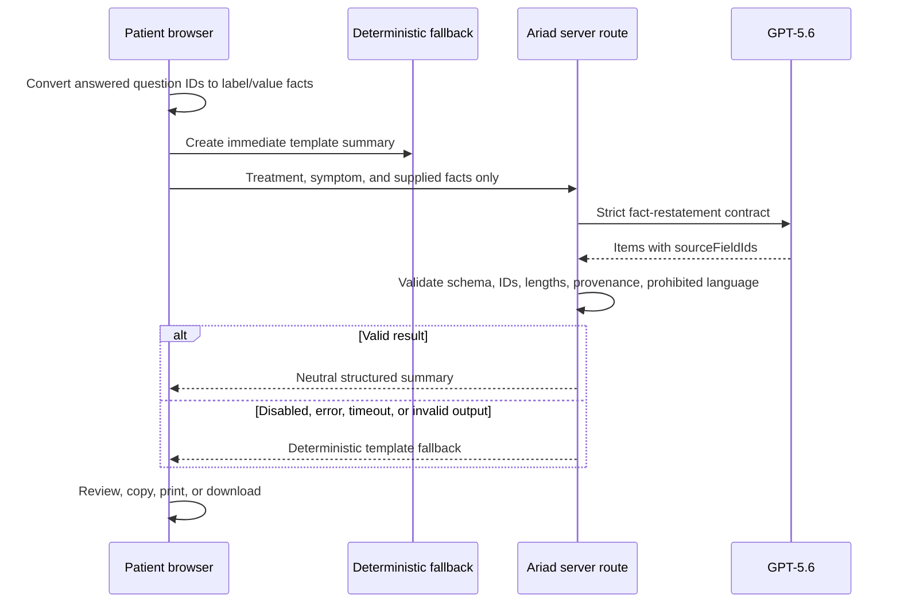

# Data flow

## 1. Build-time content flow



The compiler never approves content. The current preview path additionally
requires the exact unreviewed-content acknowledgement and emits
`clinical_use: false` plus a mandatory notice. A normal build fails because no
published release exists.

## 2. Treatment and symptom search

Treatment and symptom indexes are generated from the active release. Browser
search normalizes the query and ranks exact name, exact alias, prefix, token,
and fuzzy matches. Schedule-specific or separately named one-drug plans remain
searchable alongside their component drug. In the treatment-preparation entry,
results show exact, general, or unavailable preparation coverage; in the
symptom entry, they show the authored support status.

Selecting a catalogue item does not synthesize a relationship. Preparation
first resolves modules written for the exact treatment ID. If there are none,
it may use only the clearly labelled modules written for `systemic-therapy`.
It does not infer preparation from a drug class or regimen component. The
treatment page keeps every resolved module unchanged, then groups the authored
order into three patient questions: what the treatment is, what to do before
treatment, and what to have ready. The cause and emergency boundary remains a
separate safety note. Available side-effect education follows below it. A
multi-drug regimen presents one closed whole-drug accordion per governed
component; opening one reveals that drug's complete, independent presentation.

## 3. Natural-language symptom navigation



The model does not receive clinical modules and cannot enter the guidance path
without patient confirmation.

## 4. Questions and guidance

After category confirmation, the browser selects treatment context and asks the
pure resolver for the most specific eligible complete relationship. The
resolver's order is exact, regimen component, nearest treatment class, then
general safety, with a visible basis/reason for every fallback. The active
preview has three exact combinations and 25 general symptom fallbacks. A resolved
relationship's 3–7 question IDs determine the observable form. Answers live in
React state.

```text
observable answer
  → authored option summary text
  → authored priority tags
  → module emphasis/initial expansion
  → unchanged fixed six-section guidance
```

There is no scoring, toxicity grade, causal inference, urgency category, or
treatment recommendation. Clinical paragraphs and bullets come only from the
compiled modules.

## 5. Neutral summary



The summary is not written to a database or server history. The application
does not create a longitudinal record.

## 6. Competition persistence and reset

`NEXT_PUBLIC_ENABLE_TREATMENT_SAVING=false` is forced by the competition build
and browser-test commands. The application does not render saved-treatment
controls, does not write treatment choices, and removes a legacy
`ariad:preferences` record when it starts. The versioned local-storage adapter
remains dormant and requires the exact value `true` in a different build.

Free text, answers, candidate matches, and summary content remain in active
React state and are cleared by reset or normal session termination. Direct
`?treatment=` links remain supported; as normal web addresses, they may appear
in browser history even though Ariad does not add them to a saved list.

The current owner-directed mode sets `ENABLE_GPT56=false`, so no request data
crosses the OpenAI provider boundary. If GPT-5.6 is explicitly re-enabled in a
later phase, the minimum request data crosses that boundary. Users are always
asked not to enter identifying information; this prototype is not authorized
for PHI.

See [threat model](./threat-model.md) and [architecture](./architecture.md).
