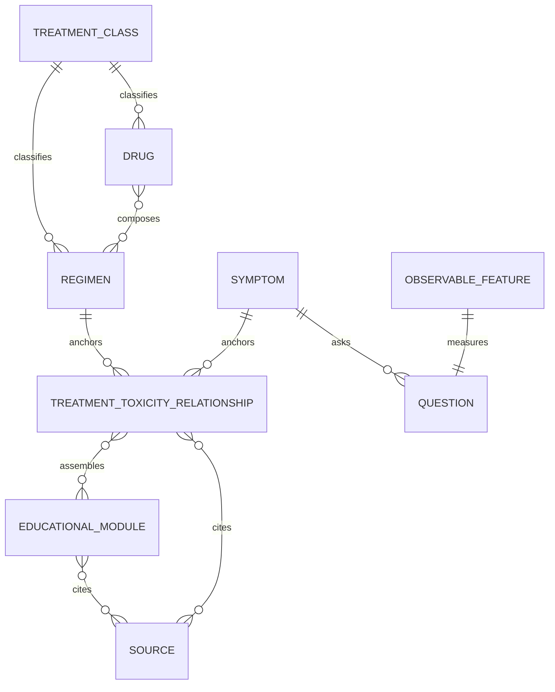

# Knowledge model

## Design intent

Ariad uses a composable, repository-backed knowledge graph without a graph
database. Human-readable YAML is validated as typed objects and compiled into a
named, immutable JSON release. The web interface consumes only that compiled
artifact; it does not traverse draft source files at runtime.

The model is portable by design. The Next.js application is one downstream
renderer, while the object, provenance, validation, and release seams can later
move into Nyx.

## First-class objects

| Kind | Role | Important links |
|---|---|---|
| `treatment_class` | Hierarchical treatment category | parent classes, description modules, sources |
| `drug` | Generic drug, brand/alias names, route, support state | classes, sources |
| `regimen` | Named treatment combination/context | component drugs, classes, sources |
| `symptom` | Normalized patient-observable or non-patient concept | observable features, general modules, sources |
| `observable_feature` | A fact the patient can directly report | answer type/options, summary field, priority tags |
| `question` | Plain-language prompt over one feature | symptom, answer options, summary mapping, prohibited interpretations |
| `educational_module` | Small source-controlled patient content unit | section, applicability, claims, sources, review status |
| `treatment_toxicity_relationship` | Exact connection driving a complete path | treatment, symptom, questions, six module slots, sources |
| `source` | Provenance metadata | organization, jurisdiction, URL, date/version, verification state |
| `clinic_config` | Exact-version local-delivery bundle | identity, structured operational contact routes, exact fever/supportive-care policy bindings |

Every governed object has a stable lowercase ID, semantic version, status,
review metadata, and prospective supersession links. Version references include
kind, ID, and exact version; a changed payload is a new version rather than an
ambient edit to a published release.

Clinic configuration contains no patient-facing clinical instruction prose.
Its local-policy bindings point to exact educational-module versions when a
policy is governed and ready; `unresolved` bindings carry no module reference
and block publication. In P0, non-unresolved policies also remain
non-publishable until governed purpose compatibility and exact renderer
consumption are implemented. The universal emergency statement is an
application safety constant and is not a clinic-configurable field.

## Relationship and guidance assembly

A `full_guidance` relationship must define:

- exactly identified treatment and symptom concepts;
- 3–7 observable questions;
- at least one module in each of `about`, `treatment_context`,
  `home_management`, `contact_team`, `urgent_attention`, and
  `reporting_checklist`;
- source IDs and review metadata.

At runtime, `assembleGuidance` resolves the most specific eligible complete
relationship in exact → regimen component → nearest treatment class → general
safety order. It labels the basis and reason whenever the result is not exact.
The active preview contains only the three exact complete relationships, so it
does not currently substitute broader guidance. The assembler returns authored
module IDs in a fixed section order. Patient-answer options contribute only
authored priority tags. Matching tags mark existing modules for emphasis; they
cannot change module text, add a clinical conclusion, or calculate an urgency
state.

## Source representation

Source objects store metadata rather than copied documents:

- canonical HTTPS URL;
- organization and jurisdiction;
- source type;
- publication/revision date and version where available;
- access date;
- verification state (`verified`, `link_only`, `unavailable`, or `retired`);
- limited excerpt and notes when appropriate.

Educational modules record source IDs and claim IDs. The claim IDs provide a
diff-friendly review handle; they are not yet a separate first-class claim
object. Jurisdictional discrepancies remain explicit in source notes and the
review report.

## Release artifact

The release manifest pins every object by kind, ID, and version and records:

- release ID and semantic version;
- preview/published channel and clinical-use flag;
- deterministic generation time;
- exact clinic configuration ref (kind, ID, and version);
- source inventory;
- reviewer/release-approval metadata;
- known gaps and release notes.

Compilation sorts objects, creates normalized treatment/symptom search indexes
and relationship adjacency maps, calculates approval counts, canonicalizes the
payload, and computes a SHA-256 content hash. It writes both:

- `apps/web/src/generated/release.json` for the application bundle; and
- `apps/web/public/releases/<release-id>.<hash>.json` as a content-addressed
  artifact.

Generated files are compiler outputs and must never be hand-edited.

## Current preview inventory

Release `build-week-preview-2026-07-18@0.5.0` pins 258 objects:

| Kind | Count |
|---|---:|
| Treatment classes | 10 |
| Drugs | 53 |
| Regimens | 8 |
| Symptoms | 28 |
| Observable features | 19 |
| Questions | 19 |
| Educational modules | 22 |
| Treatment–symptom relationships | 3 |
| Drug toxicity presentations | 25 |
| Sources | 70 |
| Clinic configurations | 1 |

Its content hash is
`e0de8058c3e9dd932c394bf56f252e7717506fdefd257ba61961862208b666d1`.
All 188 governed objects are draft. Of the 70 source records, 68 are marked
`verified` and two broad catalogue sources are `link_only`. The active release
resolves exactly one structured v2
synthetic clinic configuration. Its contact values are explicitly fictional and
non-actionable, and its fever and supportive-care policy bindings are
unresolved.

Repository-level review contains 214 governed object versions: both clinic
configuration versions and 25 private draft toxicity-evidence records in
addition to the 188 active-release objects. The manifest pins the v2 clinic
configuration and 25 patient-safe presentations, but not the numerical evidence
payloads. Neither versioning nor validation creates clinical approval evidence.

## Current single-drug toxicity implementation

The drug catalogue contains 53 canonical drug identities. Fifty-two pin an exact
current FDA label; carboplatin is retained as a source-verified breast-regimen
component. A separate source-controlled toxicity evidence store contains 25
draft records, one for each FDA label with a defensible breast-specific
single-agent frequency population. Each stores exact source event names,
percentage measures, population, dose, denominator, comparator, and provenance.
None is included in the active release.

Twenty-five separate `drug_toxicity_presentation` objects are included in the
active release. Each references the exact evidence version and clinical-payload
hash, maps every source event to a patient row or an explicit omission rationale,
and stores only patient-safe copy and qualitative groups. Build validation
derives each group from the matching all-grade adverse-reaction or adverse-event
value. Laboratory abnormalities are shown as monitoring information, and
fatal-outcome rows are not converted into patient frequency groups.

The current release contains 28 symptom concepts, of which 25 are catalogue-only
and three have complete draft guidance. Its three treatment-toxicity
relationships are all regimen-level: weekly paclitaxel/peripheral neuropathy,
capecitabine monotherapy/diarrhea, and AC/fever or infection concern. No
relationship currently uses `treatment_kind: drug`.

Each presentation includes broad qualitative frequency groups, expandable
patient rows, a cause boundary, exact FDA-linked source block, and drug-specific
final escalation summary. No presentation displays numerical frequencies,
grades, laboratory cut-offs, dose context, or treatment-change rules. All are
education-only, remain `draft`, and require clinical-owner review before Ariad
can claim approved single-drug coverage. The [coverage ledger](./fda-single-drug-toxicity-coverage.md)
records the 25 included drugs and 28 intentional evidence gaps.

## Query behavior

- Text is Unicode-normalized, lowercased for Canadian English, stripped to
  letter/number tokens, and whitespace-normalized.
- Exact name and alias matches outrank prefix, token, and Fuse.js fuzzy matches.
- Search output carries the authored support state.
- Deterministic symptom classification first looks for embedded controlled
  terms, then ranked search candidates.
- Model-assisted navigation may return only IDs from the same active release
  and still requires confirmation.

Catalogue presence and adverse-effect association are not equivalent to a full
patient-management pathway. Only a relationship with all required module slots
can produce complete guidance.

See [architecture](./architecture.md), [data flow](./data-flow.md), and [content
governance](./content-governance.md).
